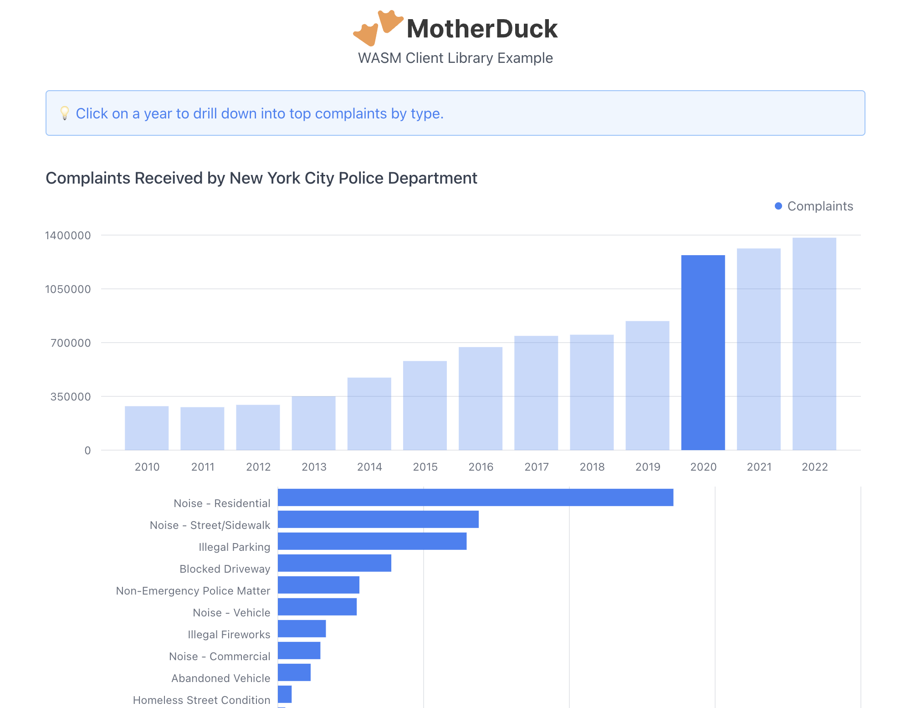

# MotherDuck WASM Client: Examples

This repository contains example projects using the [MotherDuck WASM Client Library](https://www.npmjs.com/package/@motherduck/wasm-client).

## [Mosaic Integration](./examples/mosaic-integration/)

An example integrating the MotherDuck WASM Client library with [Mosaic](https://uwdata.github.io/mosaic/) to produce interactive visualizations.

[Try the live demo!](https://motherduckdb.github.io/wasm-client/mosaic-integration/)

## [NYPD Complaints](./examples/nypd-complaints/)

An example of using the MotherDuck WASM Client library to implement a simple dashboard showing the different types of complaints received by the New York City Police Department from 2010 through 2022. (Data sourced from [here](https://data.cityofnewyork.us/Social-Services/311-Service-Requests-from-2010-to-Present/erm2-nwe9).)

[Try the live demo!](https://motherduckdb.github.io/wasm-client/nypd-complaints/)

