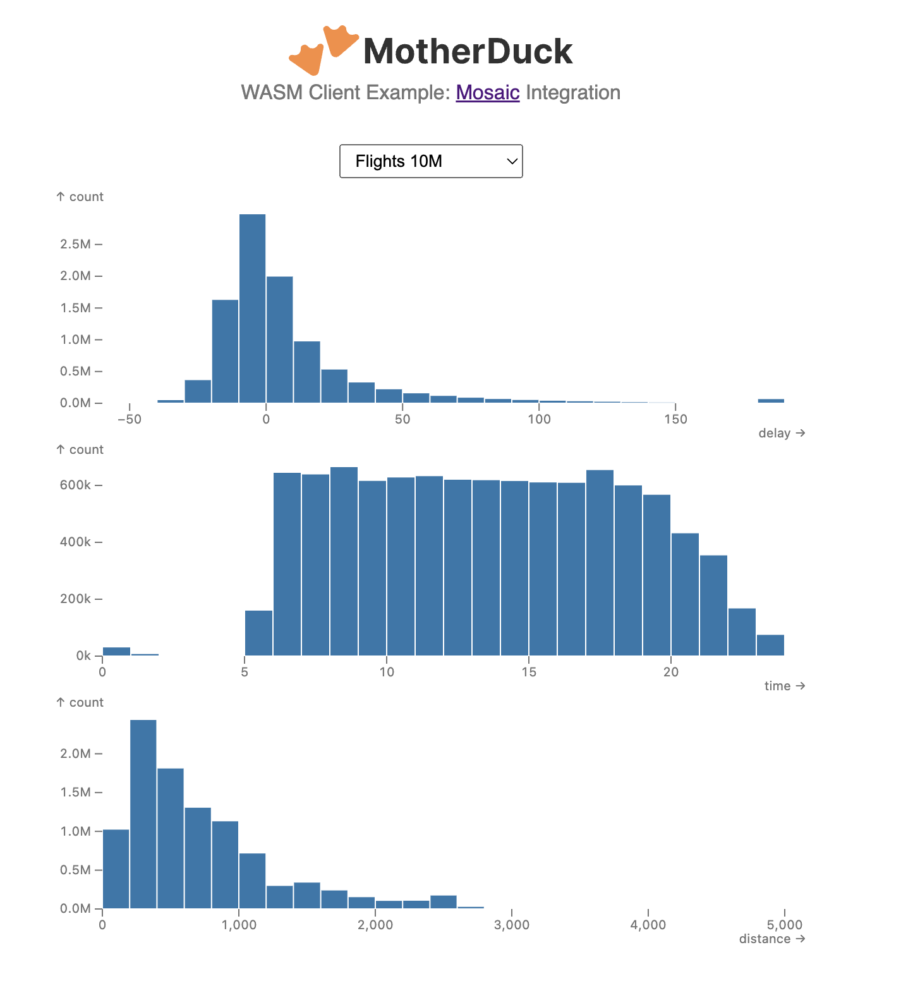

# MotherDuck WASM Client: Examples

This repository contains example projects using the [MotherDuck WASM Client library](https://www.npmjs.com/package/@motherduck/wasm-client).

## Mosaic Integration

An [example](./examples/mosaic-integration/) integrating the [MotherDuck WASM Client library](https://www.npmjs.com/package/@motherduck/wasm-client) with [Mosaic](https://uwdata.github.io/mosaic/) to produce interactive visualizations.

[Code](./examples/mosaic-integration/) | [Demo](https://motherduckdb.github.io/wasm-client/mosaic-integration/)

## NYPD Complaints

An [example](./examples/nypd-complaints/) of using the [MotherDuck WASM Client library](https://www.npmjs.com/package/@motherduck/wasm-client) to implement a simple dashboard showing the different types of complaints received by the New York City Police Department from 2010 through 2022. (Data sourced from [here](https://data.cityofnewyork.us/Social-Services/311-Service-Requests-from-2010-to-Present/erm2-nwe9).)

[Code](./examples/nypd-complaints/) | [Demo](https://motherduckdb.github.io/wasm-client/nypd-complaints/)

## Data App Generator

An [AI coding assistant](./data-app-generator/) for MotherDuck data apps using the [MotherDuck WASM Client library](https://www.npmjs.com/package/@motherduck/wasm-client).
