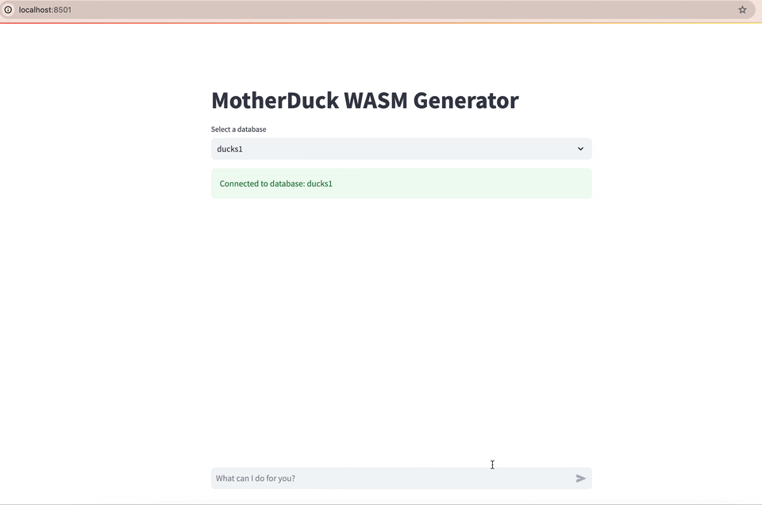

# MotherDuck Data App Generator

## Setup

1. Install Python 3.11+
2. Install node and npm (`brew install node; brew install npm`)
3. `pip install -r requirements.txt`
4. `cd my-app/` & `npm install` & `npx shadcn-ui@0.8.0 init --yes -d`
5. Go to [https://app.motherduck.com/](https://app.motherduck.com/), create a MotherDuck token, and set environment variable motherduck_token='your-motherduck-token'
6. Go to [https://openrouter.ai/](https://openrouter.ai/) and create an API key, and set environment variable OPENROUTER_API_KEY='your-api-key'
7. `streamlit run main.py`

## Demo

