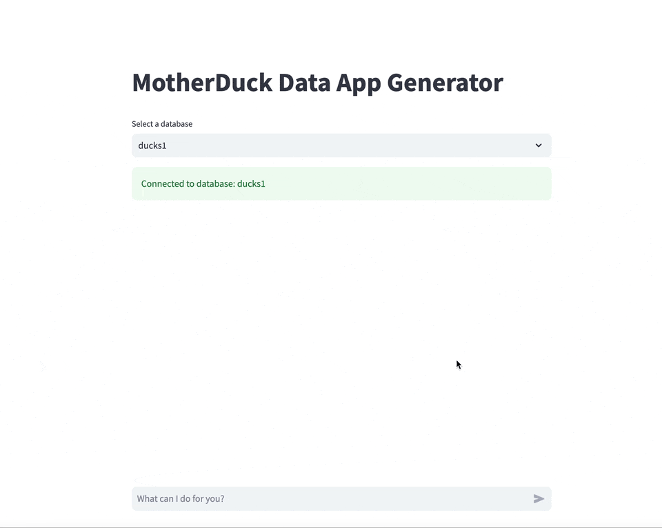
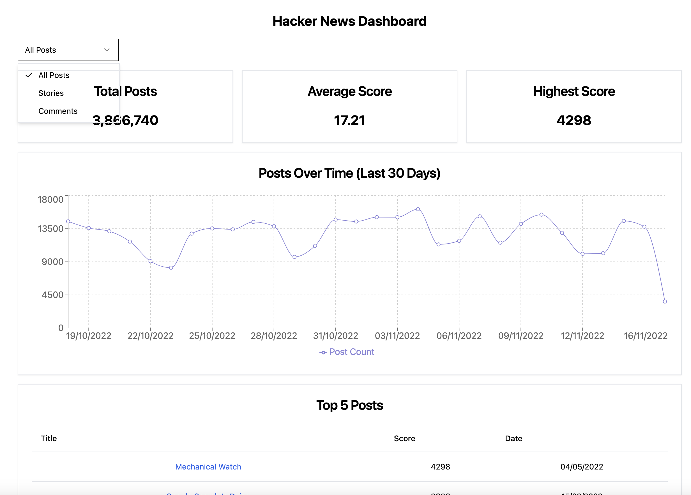
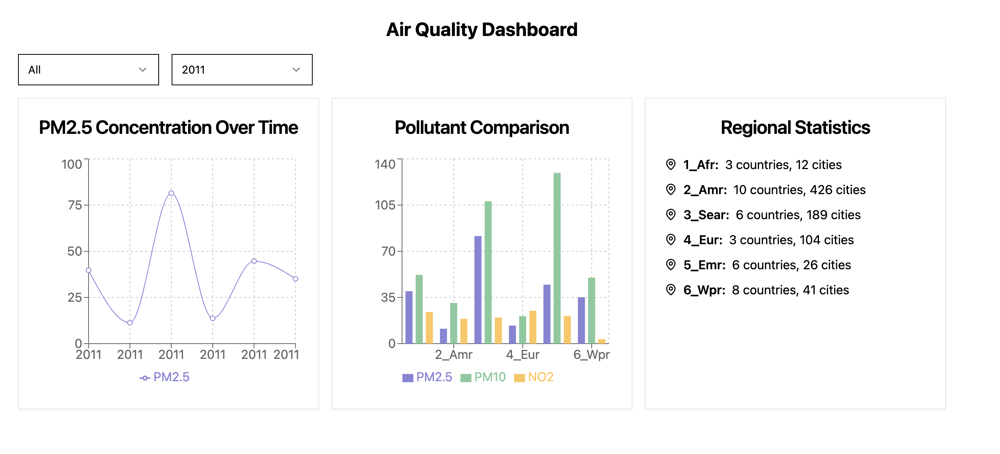
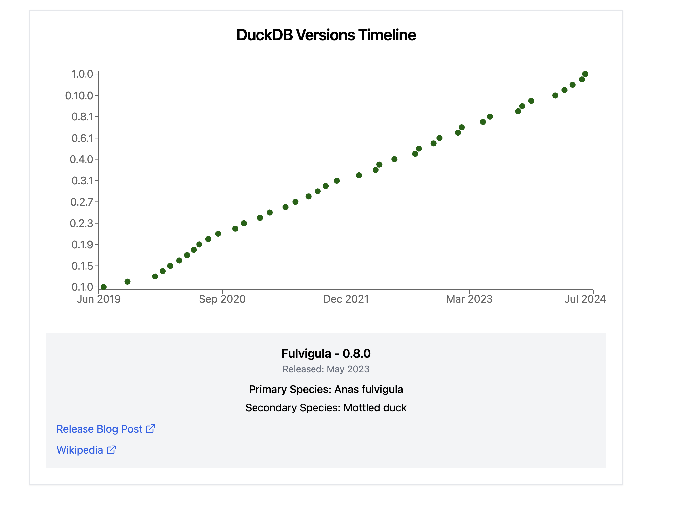

# MotherDuck Data App Generator

## Setup

1. Install Python 3.11+
2. Install node and npm (`brew install node; brew install npm`)
3. `pip install -r requirements.txt`
4. `cd my-app/` & `npm install` & `npx shadcn-ui@0.8.0 init --yes -d`
5. Go to [https://app.motherduck.com/](https://app.motherduck.com/), create a MotherDuck token, and set environment variable motherduck_token='your-motherduck-token'
6. Go to [https://openrouter.ai/](https://openrouter.ai/) and create an API key, and set environment variable OPENROUTER_API_KEY='your-api-key'
7. `streamlit run main.py`

## To build apps effectively
- To build apps effectively
- Start with a basic version of your app.
- Build iteratively by adding new features one at a time.
- Be specific in your requests for each iteration.
- Review and test each change before moving to the next.
- If something isn't working as expected, provide the error messages to the agent for troubleshooting.
- Complex apps are built step by step. Take your time and enjoy the process!

## Troubleshooting
- Check for errors in the UI and the Browser console.
- Check the browser console (F12 > Console) for JavaScript errors.
- If you encounter UI issues, describe them to the agent.

## Limitations:
- **Disclaimer**: The produced code should not be used in production without an additional review.
- **JavaScript**: The code uses JavaScript; we recommend using TypeScript for production apps.
- **String-Templated Queries**: The code uses JavaScript string-templated queries. We recommend using prepared statements instead. For more information, visit [Prepared Statements](https://www.npmjs.com/package/@motherduck/wasm-client#prepared-statements).
- **Authentication Flow**: If you want to learn more about how to add an authentication flow for external users, take a look at [this example](https://github.com/motherduckdb/wasm-client/blob/main/examples/nypd-complaints/src/ConnectPane.tsx). 

## OpenRouter API:
- Each request incurs ~0.05$ in OpenRouter API costs.

## Demo

## More Examples
Hacker News: "Create a dashboard for hacker news posts"

Air Quality: "Create a dashboard for air quality across different times and regions"

DuckDB Versions: "Show a timeline of DuckDB versions with their wikipedia url and some additional info when clicking on one of the versions in the timeline"

[Requires a database with a duck_versions table: `CREATE TABLE duck_versions AS FROM read_csv(https://duckdb.org/data/duckdb-releases.csv)`]
