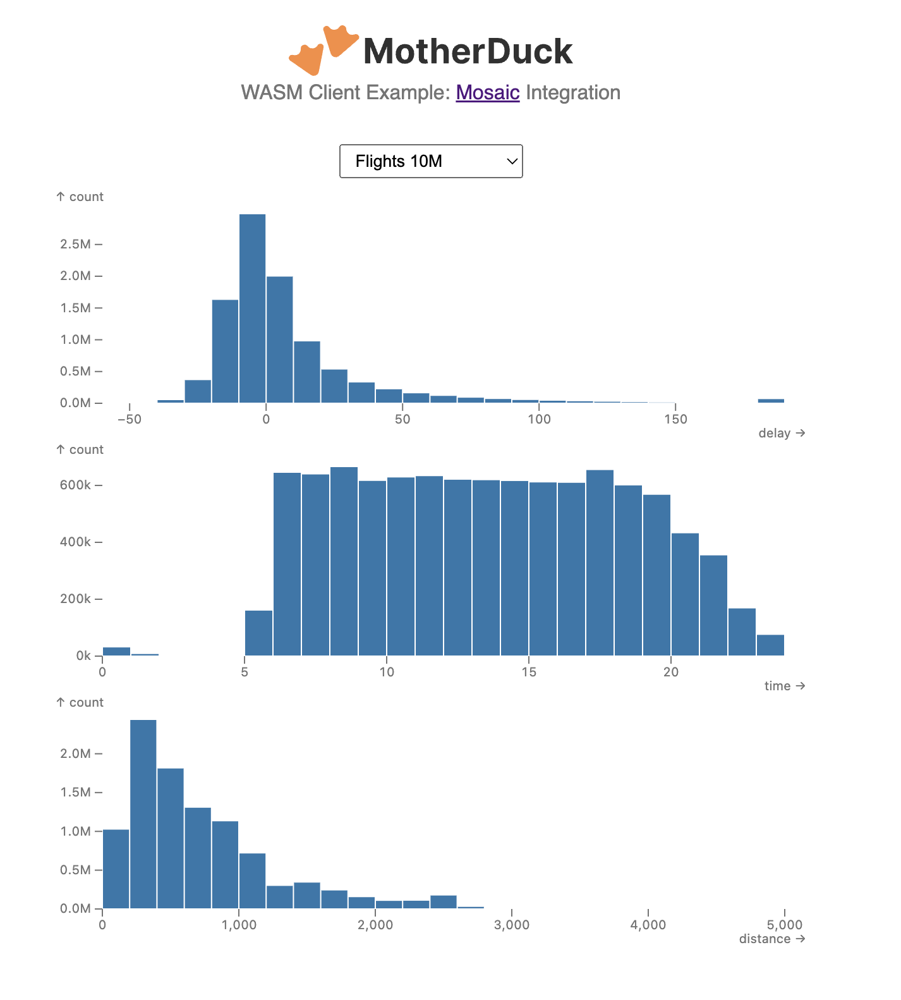

# MotherDuck WASM Client Example: Mosaic Integration

An example integrating the MotherDuck WASM Client library with [Mosaic](https://uwdata.github.io/mosaic/) to produce interactive visualizations.

[Try the live demo!](https://motherduckdb.github.io/wasm-client/mosaic-integration/)

[](https://motherduckdb.github.io/wasm-client/mosaic-integration/)

## Usage

Install dependencies and run the dev server:

```
npm install
```
```
npm run dev
```

Navigate to the localhost URL displayed.

Copy your MotherDuck service token from your account (in the Settings area of the user menu) and paste it into the input field indicated.
Click "Connect".
If you need to reconnect, first refresh the page.

The example contains multiple visualizations. Select between them using the selector at the top.

The "Mark Types" example reproduces the [Mosaic example](https://uwdata.github.io/mosaic/examples/mark-types.html) of the same name. By default, it generates local data, but an option can be toggled in code to use a MotherDuck share instead. See instructions in [MarkTypesViz.ts](src/vizzes/MarkTypesViz.ts).

The "NYPD Complaints" example implements a Mosaic version of the [MotherDuck WASM Client example](../nypd-complaints/README.md) of the same name. It similarly depends on the `sample_data` database automatically attached to MotherDuck accounts. If your account does not have this database, you can reattach it by running:

```sql
ATTACH 'md:_share/sample_data/23b0d623-1361-421d-ae77-62d701d471e6';
```

The "Flights" (both 200K and 10M row versions), "Earthquakes", "Gaia Star Catalog" and "Seattle Weather" examples reproduce the similarly-named Mosaic examples, see: [Cross-Filter Flights (200K)](https://uwdata.github.io/mosaic/examples/flights-200k.html), [Cross-Filter Flights (10M)](https://uwdata.github.io/mosaic/examples/flights-10m.html), [Earthquakes](https://uwdata.github.io/mosaic/examples/earthquakes.html), [Gaia Star Catalog](https://uwdata.github.io/mosaic/examples/gaia.html) and [Seattle Weather](https://uwdata.github.io/mosaic/examples/weather.html). They all depend on access to a MotherDuck share. To attach this share to your account, run:

```sql
ATTACH 'md:_share/mosaic_examples/b01cfda8-239e-4148-a228-054b94cdc3b4';
```

These example demonstrate using MotherDuck's hybrid execution to materialize remote data into temporary local tables to improve interactive performance. See, for example, the `initialize` method in [NYPDComplaintsViz.ts](src/vizzes/NYPDComplaintsViz.ts).

## Implementation

The main integration with Mosiac is in [mdConnector.ts](src/mdConnector.ts). This implements a custom [Mosaic Connector](https://uwdata.github.io/mosaic/api/core/connectors.html) that connects to MotherDuck, given a MotherDuck service token.

Because Mosaic expects results in [Arrow](https://github.com/apache/arrow) Table format in some cases, this connector uses the MotherDuck WASM Client API that returns the underlying Arrow RecordBatch stream, reads all batches from that stream, and constructs an Arrow Table from them.

The singleton [Mosaic Coordinator](https://uwdata.github.io/mosaic/api/core/coordinator.html) is configured with this custom connector in [App.tsx](src/App.tsx), after receiving the MotherDuck service token from the user.
