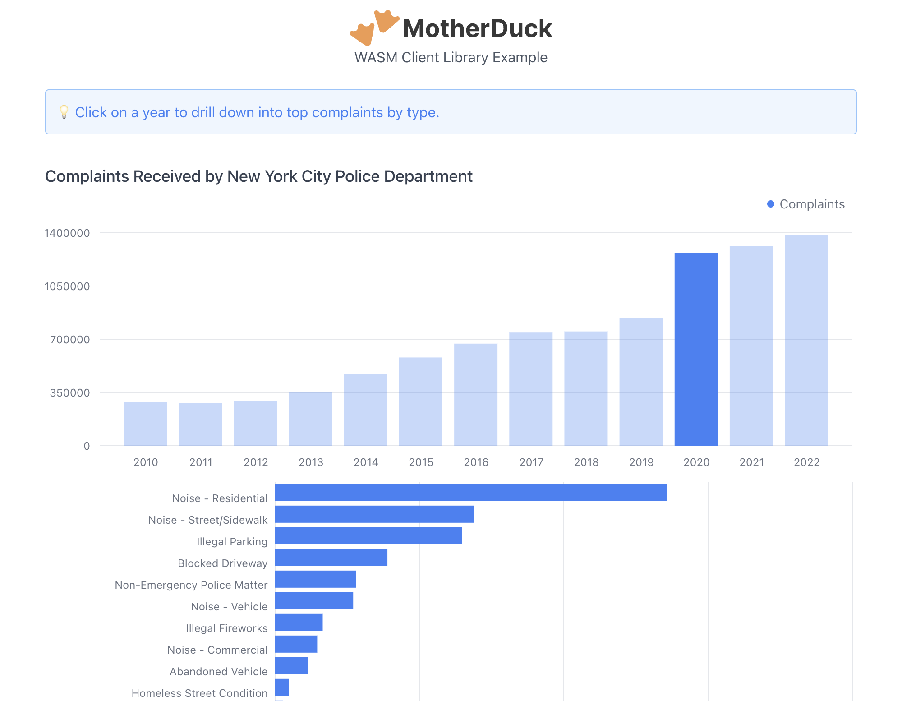

# MotherDuck WASM Client Example: NYPD Complaints

An example of using the MotherDuck WASM Client library to implement a simple dashboard showing the different types of complaints received by the New York City Police Department from 2010 through 2022. (Data sourced from [here](https://data.cityofnewyork.us/Social-Services/311-Service-Requests-from-2010-to-Present/erm2-nwe9).)

[Try the live demo!](https://motherduckdb.github.io/wasm-client/nypd-complaints/)

[](https://motherduckdb.github.io/wasm-client/nypd-complaints/)

## Usage

Install dependencies and run the dev server:

```
npm install
```
```
npm run dev
```

Navigate to the localhost URL displayed.

Copy your MotherDuck service token from your account (in the Settings area of the user menu) and paste it into the input field indicated.
Click "Connect".
If you need to reconnect, first refresh the page.

The example will run a query and display the result in a bar chart in the top part of the page.
Click on a bar to run another query and display details in another chart below.

Note: The example uses the `sample_data` database automatically attached to MotherDuck accounts. If your account does not have this database, you can reattach it by running:

```sql
attach 'md:_share/sample_data/23b0d623-1361-421d-ae77-62d701d471e6';
```

## Implementation

This example is written in [TypeScript](https://www.typescriptlang.org/) and uses [React](https://react.dev/) and [Tremor](https://www.tremor.so/) to render the UI. The build and dev server use [Vite](https://vitejs.dev/); the project was generated from the [react-ts Vite template](https://github.com/vitejs/vite/tree/main/packages/create-vite/template-react-ts).

The main uses of the MotherDuck WASM Client library are in [useMDConnection.ts](src/useMDConnection.ts) and [ChartsPane.tsx](src/ChartsPane.tsx).

The [useMDConnection](src/useMDConnection.ts) hook uses [MDConnection.create](../../README.md#creating-connections) to create a connection using a MotherDuck token. This hook is called by [App.tsx](src/App.tsx), and the connection is passed down to the child components, [ConnectPane](src/ConnectPane.tsx) and [ChartsPane](src/ChartsPane.tsx). [ConnectPane](src/ConnectPane.tsx) also receives the `connect` method from this hook, which it calls when the user clicks the "Connect" button.

The [ChartsPane](src/ChartsPane.tsx) uses the connection to [run a SQL query](../../README.md#evaluating-queries) for the initial data when first rendered. When the user clicks a bar, a callback runs a dynamically-generated SQL query to fetch data for the bottom chart. The SQL queries can be found in [sql.ts](src/sql.ts).

## Configuration

One piece of nonstandard configuration is required:

- The necessary headers to trigger [cross-origin isolation](../../README.md#requirements) are set in [vite.config.ts](vite.config.ts).